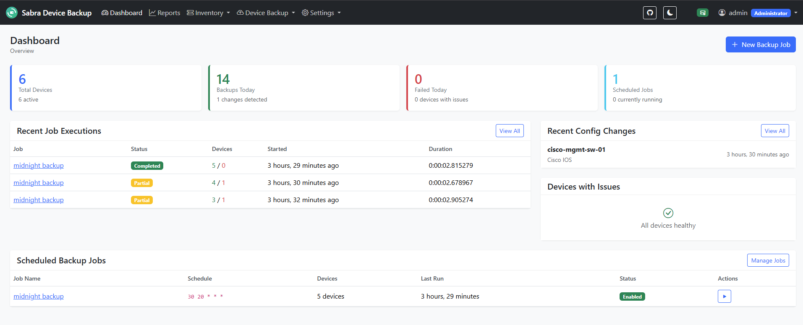
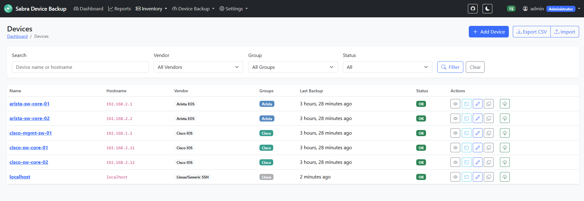
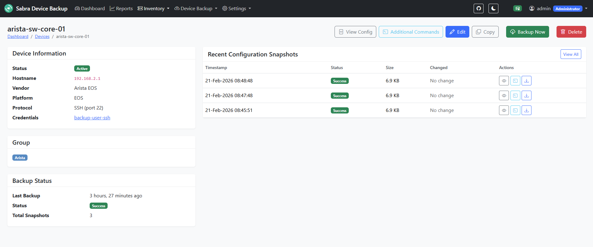
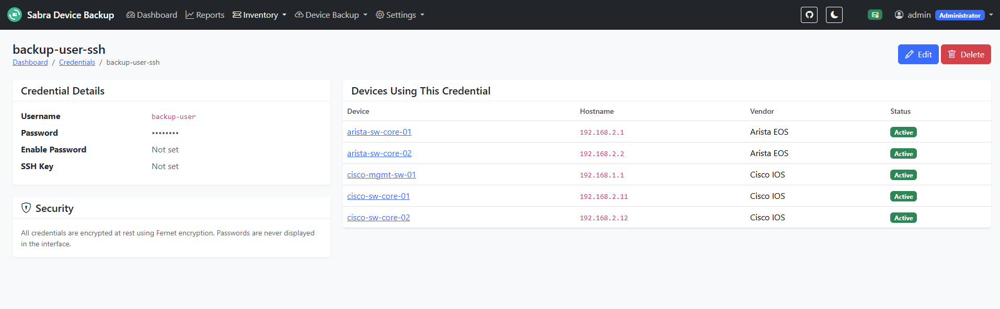
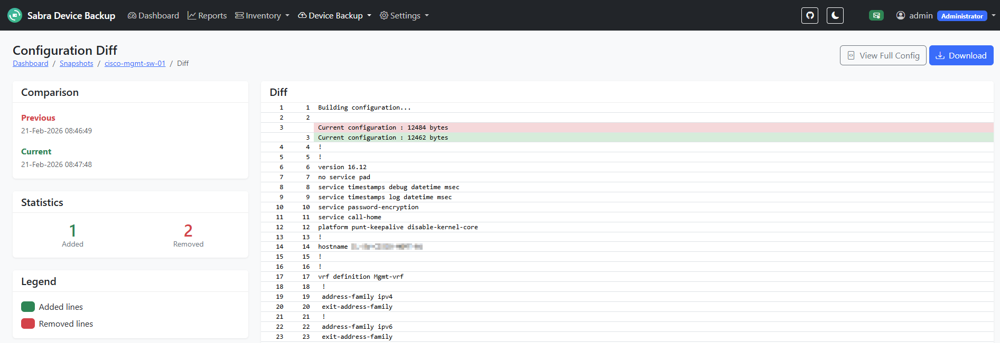

# Sabra Device Backup

**A production-ready Django web application for automated network device configuration backups.**

Self-hosted alternative to SolarWinds Kiwi CatTools — supports Cisco IOS, Juniper JunOS, Arista EOS, FortiGate, and Generic SSH devices.

---

## Architecture Overview

```
┌─────────────────────────────────────────────────────────────────────────────────┐
│                              SABRA DEVICE BACKUP                                │
│                         Network Configuration Backup System                      │
└─────────────────────────────────────────────────────────────────────────────────┘

┌──────────────────┐     HTTPS/443      ┌──────────────────┐
│    Web Browser   │◄──────────────────►│      NGINX       │
│   (Admin/Ops)    │                    │  (Reverse Proxy) │
└──────────────────┘                    │   + SSL/TLS      │
                                        └────────┬─────────┘
                                                 │
                                                 ▼
┌─────────────────────────────────────────────────────────────────────────────────┐
│                              DJANGO APPLICATION                                  │
│  ┌─────────────┐  ┌─────────────┐  ┌─────────────┐  ┌─────────────┐            │
│  │  inventory  │  │   backups   │  │ activities  │  │   reports   │            │
│  │   (Devices, │  │   (Jobs,    │  │  (Ad-hoc    │  │  (History,  │            │
│  │   Profiles, │  │  Snapshots, │  │   CLI       │  │   Status    │            │
│  │   Groups)   │  │   Diffs)    │  │   Commands) │  │   Reports)  │            │
│  └─────────────┘  └─────────────┘  └─────────────┘  └─────────────┘            │
│  ┌─────────────┐  ┌─────────────┐                                               │
│  │  accounts   │  │ mailconfig  │  ← Encrypted email credentials (Fernet)      │
│  │   (Auth,    │  │  (SMTP      │                                               │
│  │   Roles)    │  │   Config)   │                                               │
│  └─────────────┘  └─────────────┘                                               │
└─────────────────────────────────────────────────────────────────────────────────┘
         │                    │                              │
         ▼                    ▼                              ▼
┌─────────────────┐  ┌─────────────────┐           ┌─────────────────┐
│   PostgreSQL    │  │      Redis      │           │   Celery Beat   │
│   (Database)    │  │  (Message Broker│           │   (Scheduler)   │
│                 │  │   + Result      │           │                 │
│  - Devices      │  │   Backend)      │           │  Cron-like      │
│  - Configs      │  │                 │           │  Job Scheduling │
│  - Jobs         │  └────────┬────────┘           └────────┬────────┘
│  - Users        │           │                             │
│  - MailConfig   │           ▼                             ▼
└─────────────────┘  ┌─────────────────────────────────────────────────┐
                     │              CELERY WORKERS                      │
                     │  ┌─────────────────────────────────────────────┐ │
                     │  │              VENDOR DRIVERS                 │ │
                     │  │  ┌─────────┐ ┌─────────┐ ┌─────────┐       │ │
                     │  │  │ Cisco   │ │ JunOS   │ │ Arista  │       │ │
                     │  │  │ IOS     │ │ Driver  │ │ EOS     │       │ │
                     │  │  └─────────┘ └─────────┘ └─────────┘       │ │
                     │  │  ┌─────────┐ ┌─────────┐                   │ │
                     │  │  │FortiGate│ │ Generic │                   │ │
                     │  │  │ Driver  │ │ SSH     │                   │ │
                     │  │  └─────────┘ └─────────┘                   │ │
                     │  └─────────────────────────────────────────────┘ │
                     └───────────────────────┬─────────────────────────┘
                                             │
                          SSH/Telnet (22/23) │
                                             ▼
┌─────────────────────────────────────────────────────────────────────────────────┐
│                           NETWORK DEVICES                                        │
│  ┌───────────┐  ┌───────────┐  ┌───────────┐  ┌───────────┐  ┌───────────┐     │
│  │  Cisco    │  │  Juniper  │  │  Arista   │  │ FortiGate │  │  Generic  │     │
│  │  Routers  │  │  Switches │  │  Switches │  │ Firewalls │  │  Linux    │     │
│  │  Switches │  │  Routers  │  │           │  │           │  │  Servers  │     │
│  └───────────┘  └───────────┘  └───────────┘  └───────────┘  └───────────┘     │
└─────────────────────────────────────────────────────────────────────────────────┘

DATA FLOW (READ-ONLY):
═══════════════════════
1. Celery Beat triggers scheduled backup job
2. Celery Worker picks up task from Redis queue
3. Worker uses appropriate Vendor Driver
4. Driver connects via SSH/Telnet (Netmiko)
5. Driver executes read-only commands (show running-config, etc.)
6. Configuration stored as Snapshot in PostgreSQL
7. Change detection compares with previous snapshot
8. If changed: generate diff, send email alert
9. Web UI displays history, diffs, reports

SECURITY NOTES:
═══════════════
• All credentials encrypted at rest (Fernet)
• Email config stored encrypted in DB (not config files)
• Application secrets stored in /etc/sabra/environment (root only, mode 600)
• No plaintext secrets in application code or config files
• Systemd loads secrets at service startup (never readable by app user)
• Backup of secrets in /root/.sabra-credentials
• HTTPS enforced via NGINX + self-signed SSL
• Role-based access (Admin/Operator)
• READ-ONLY network access (no config push)
```

---

## Technology Stack

| Component | Technology | Purpose |
|-----------|-----------|---------|
| **Web Framework** | Django 5.x | Backend + templates |
| **UI** | Bootstrap 5 + Django Templates | Responsive web interface |
| **Database** | PostgreSQL 16 (prod) / SQLite (dev) | Persistent storage |
| **Task Queue** | Celery 5.x | Background job processing |
| **Message Broker** | Redis 7.x | Celery broker + result backend |
| **Scheduler** | Celery Beat | Cron-like job scheduling |
| **Network Automation** | Netmiko 4.x | Multi-vendor SSH/Telnet |
| **Encryption** | django-fernet-fields | Field-level encryption |
| **Web Server** | Gunicorn + NGINX | Production WSGI + reverse proxy |
| **SSL** | Self-signed certificate | HTTPS for internal network use |
| **Process Manager** | systemd | Service management + auto-restart |
| **OS** | Ubuntu 24.04 LTS | Production deployment |

---

## Supported Vendors

| Vendor | Netmiko Device Type | Backup Commands |
|--------|---------------------|-----------------|
| **Cisco IOS** | `cisco_ios` | `terminal length 0`, `show running-config` |
| **Juniper JunOS** | `juniper_junos` | `set cli screen-length 0`, `show configuration` |
| **Arista EOS** | `arista_eos` | `terminal length 0`, `show running-config` |
| **FortiGate** | `fortinet` | `show full-configuration` |
| **Generic SSH** | `linux` | Configurable commands |

---

## Features

### ✅ Device Inventory
- Device name, IP/hostname, vendor, platform
- SSH/Telnet port configuration
- Credential profiles (encrypted)
- Device groups and tags
- Bulk import/export (JSON/CSV)

### ✅ Automated Backups
- Cron-style scheduling (daily, hourly, custom)
- Store configuration snapshots with metadata
- Skip unchanged configurations (deduplication)
- Parallel backup execution

### ✅ Change Detection
- Automatic diff between current and previous config
- Side-by-side diff viewer
- Email alerts on config changes
- Email alerts on backup failures

### ✅ Export & Import
- Export configs to ZIP, TAR.GZ, or JSON
- Import configs from files or archives
- Export/import device inventory for migration
- Compare imported configs without saving

### ✅ Ad-hoc CLI Commands
- Run show commands on multiple devices
- Store command output as reports
- Command templates for common operations

### ✅ Reports & History
- Complete configuration history per device
- Backup job status dashboard
- Success/failure statistics
- Export reports (CSV)

### ✅ Security
- Role-based access (Admin/Operator)
- Encrypted credentials in database (Fernet)
- Encrypted email configuration (stored in DB, not files)
- Application secrets in protected environment file (root only)
- HTTPS with self-signed certificate

---

## Quick Start (Ubuntu 24.04)

### Prerequisites

- Fresh Ubuntu 24.04 LTS server
- Root or sudo access
- Domain name pointing to server (for SSL)
- Minimum 2GB RAM, 20GB disk

### Automated Installation

```bash
# Clone the repository
cd /opt/
git clone https://github.com/CheapVibe/sabra-device-backup.git /opt/sabra-device-backup
cd /opt/sabra-device-backup

# Run automated setup
sudo ./setup.sh
```

---

## Post-Installation Configuration

### 1. Configure Email (Web UI)

1. Login to admin panel: `https://your.domain.com/admin/`
2. Navigate to: **Mail Config → Mail Server Configs**
3. Add new configuration:
   - **Host**: smtp.gmail.com (or your SMTP server)
   - **Port**: 587
   - **Username**: your-email@gmail.com
   - **Password**: Your app password (encrypted automatically)
   - **Use TLS**: ✅
   - **From Email**: noreply@your.domain.com
   - **Is Active**: ✅

All email credentials are encrypted at rest using Fernet encryption.

### 2. Add Credential Profiles

1. Navigate to: **Inventory → Credential Profiles**
2. Add profiles for your devices:
   - Profile name (e.g., "Cisco-Admin")
   - Username
   - Password (encrypted)
   - Enable password (for Cisco devices)

### 3. Add Devices

1. Navigate to: **Inventory → Devices**
2. Add your network devices:
   - Name, IP address, vendor
   - SSH/Telnet port
   - Credential profile
   - Device group (optional)

### 4. Create Backup Jobs

1. Navigate to: **Backups → Backup Jobs**
2. Create scheduled backup:
   - Select devices or device groups
   - Set schedule (cron expression)
   - Enable email notifications

---

## Upgrading

### Standard Upgrade

To upgrade an existing installation to the latest version:

```bash
cd /opt/sabra-device-backup
sudo ./scripts/upgrade.sh
```

The upgrade script automatically handles:
- ✅ Database backup before any changes
- ✅ Git pull to fetch latest code
- ✅ Python dependency updates
- ✅ Database migrations
- ✅ Static file collection
- ✅ Service restarts (sabra, celery, celery-beat)
- ✅ Health checks after upgrade

### Upgrade Options

```bash
# Check current vs available version
sudo ./scripts/upgrade.sh --version

# Preview changes without applying (dry run)
sudo ./scripts/upgrade.sh --dry-run

# Skip confirmation prompts (for automation)
sudo ./scripts/upgrade.sh --force

# Skip database backup (not recommended)
sudo ./scripts/upgrade.sh --skip-backup
```

### Rollback

If an upgrade causes issues, rollback to the previous version:

```bash
sudo ./scripts/upgrade.sh --rollback
```

This restores:
- Previous code version (via git checkout)
- Database backup (optional, prompts for confirmation)

---

## Usage

### Dashboard

Access the main dashboard at `https://your.domain.com/` to view:
- Recent backup status
- Device health overview
- Change detection alerts
- Quick actions

### Manual Backup

1. Navigate to: **Backups → Devices**
2. Select devices to backup
3. Click "Backup Now"
4. Monitor progress in job status

### View Configuration History

1. Navigate to: **Backups → Snapshots**
2. Select a device
3. View all stored configurations
4. Compare versions with diff viewer

### Run Ad-hoc Commands

1. Navigate to: **Backups → Run Command**
2. Select target devices
3. Enter command (e.g., `show version`)
4. Execute and view results

### Export Configurations

Export device configurations for backup, archiving, or migration:

1. Navigate to: **Backups → Export / Import** or **Snapshots → Export**
2. Select devices and/or device groups
3. Choose export format:
   - **ZIP** - Archive with one folder per device
   - **TAR.GZ** - Compressed archive for Unix systems
   - **JSON** - Full metadata, can be re-imported
4. Choose snapshot selection:
   - **Latest** - Most recent successful backup per device
   - **All** - All backups within date range
5. Click **Export** to download

### Import Configurations

Import configurations from files (e.g., from another backup system):

1. Navigate to: **Backups → Import**
2. Upload file (ZIP, TAR.GZ, JSON, or single config file)
3. Choose action:
   - **Compare Only** - View differences without saving
   - **Create Snapshots** - Store as historical backups
4. Review matched devices and select targets
5. Confirm import

### Export Inventory

Export device inventory for backup or migration to another Sabra instance:

1. Navigate to: **Inventory → Export** or **Backups → Export Inventory**
2. Choose format:
   - **JSON** - Full export, re-importable
   - **CSV** - Spreadsheet format
3. Select what to include:
   - Device Groups
   - Backup Jobs
   - Credential Profiles (usernames only)
4. Click **Export**

> **Note:** Passwords and SSH keys are never exported. After importing on a new system, update credentials manually.

### Import Inventory

Import device inventory from JSON export:

1. Navigate to: **Inventory → Import** or **Backups → Import Inventory**
2. Upload JSON file from previous Sabra export
3. Choose whether to skip or update existing devices
4. Review and confirm import

After import:
1. Create/update credential profiles with passwords
2. Assign credentials to devices
3. Test device connectivity
4. Enable backup jobs

---

## User Roles

| Role | Permissions |
|------|-------------|
| **Admin** | Full access: manage devices, credentials, jobs, users, mail config |
| **Operator** | View devices, run backups, view configs, run ad-hoc commands (read-only) |

---

## Secrets Management

Application secrets (SECRET_KEY, DATABASE_PASSWORD, FERNET_KEY) are stored securely:

### Secret Locations

| File | Purpose | Permissions |
|------|---------|-------------|
| `/etc/sabra/environment` | Production secrets (loaded by systemd) | root:root 600 |
| `/root/.sabra-credentials` | Backup copy for disaster recovery | root:root 600 |
| `sabra/settings/local.py` | Django config (references `os.environ`) | No secrets |

### How It Works

1. Systemd reads `/etc/sabra/environment` as root at service startup
2. Environment variables are passed to the application process
3. Django reads secrets from `os.environ` - never from files
4. The `sabra` user cannot read the secrets file directly

### Disaster Recovery

If you need to recover secrets:

```bash
# View backup credentials (as root)
sudo cat /root/.sabra-credentials
```

### Rotating Secrets

To rotate the Django SECRET_KEY (will invalidate all sessions):

```bash
# Generate new key
python3 -c "import secrets; print(secrets.token_urlsafe(50))"

# Update environment file
sudo nano /etc/sabra/environment
# Change SECRET_KEY=... value

# Restart services
sudo systemctl restart sabra celery celery-beat
```

### Migrating from Old Format

If upgrading from an older version with plaintext secrets in `local.py`:

```bash
# The upgrade script handles this automatically
sudo ./scripts/upgrade.sh
```

---

## Troubleshooting

### Service Status

```bash
# Check all services
sudo systemctl status sabra.service celery.service celery-beat.service

# View logs
sudo journalctl -u sabra.service -f
sudo journalctl -u celery.service -f
sudo journalctl -u celery-beat.service -f
```

### Database Issues

```bash
# Check PostgreSQL
sudo systemctl status postgresql
sudo -u postgres psql -c "SELECT 1;"

# Reset migrations (development only!)
cd /opt/sabra-device-backup
source venv/bin/activate
python manage.py migrate --fake-initial
```

### Redis Issues

```bash
# Check Redis
sudo systemctl status redis-server
redis-cli ping  # Should return PONG
```

### Permission Issues

```bash
# Fix ownership
sudo chown -R www-data:www-data /opt/sabra-device-backup
sudo chown -R www-data:www-data /var/log/sabra /var/log/celery
```

### SSL Certificate Renewal

The self-signed certificate is valid for 365 days. To renew:

```bash
# Regenerate certificate
sudo openssl req -x509 -nodes -days 365 -newkey rsa:2048 \
    -keyout /etc/ssl/private/sabra-selfsigned.key \
    -out /etc/ssl/certs/sabra-selfsigned.crt \
    -subj "/CN=$(hostname -f)"

# Reload nginx
sudo systemctl reload nginx
```

---

## Backup & Restore

### Database Backup

```bash
# Backup
sudo -u postgres pg_dump sabra > /backup/sabra_$(date +%Y%m%d).sql

# Restore
sudo -u postgres psql sabra < /backup/sabra_YYYYMMDD.sql
```

### Application Backup

```bash
# Backup entire application
tar -czvf /backup/sabra_app_$(date +%Y%m%d).tar.gz /opt/sabra-device-backup
```

---

## Development Setup

```bash
# Clone repository
git clone https://github.com/CheapVibe/sabra-device-backup.git
cd sabra-device-backup

# Create virtual environment
python3.12 -m venv venv
source venv/bin/activate

# Install dependencies
pip install -r requirements.txt

# Use SQLite for development
export DJANGO_SETTINGS_MODULE=sabra.settings.base

# Run migrations
python manage.py migrate

# Create superuser
python manage.py createsuperuser

# Start development server
python manage.py runserver

# Start Celery worker (separate terminal)
celery -A sabra worker -l info

# Start Celery Beat (separate terminal)
celery -A sabra beat -l info
```

## Screenshots

### Dashboard
Overview of backup status, device health, and recent activity.



### Device Inventory
Manage your network devices with filtering, tags, and bulk operations.



### Device Details
Detailed view of device configuration, backup history, and status.



### Credential Profiles
Securely manage encrypted credentials for device authentication.



### Configuration Diff
Side-by-side comparison showing configuration changes between backups.



---

## License

AGPL-3.0 License - See [LICENSE](LICENSE) file.

---

## Contributing

1. Fork the repository
2. Create feature branch (`git checkout -b feature/amazing-feature`)
3. Commit changes (`git commit -m 'Add amazing feature'`)
4. Push to branch (`git push origin feature/amazing-feature`)
5. Open Pull Request

---

## Support

- **Issues**: GitHub Issues
- **Documentation**: `/docs` directory
- **Wiki**: GitHub Wiki

---

**Sabra Device Backup** - Secure, automated network configuration backups.
